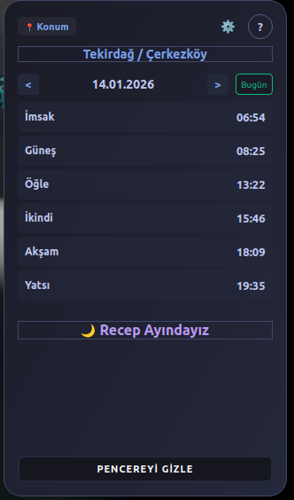
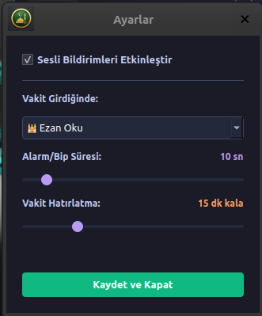

# 🕌 Namaz Vakti v1.0


Linux masaüstü ortamları için geliştirilmiş; şeffaf, modern ve kullanıcı dostu Namaz Vakti görüntüleme aracı.

## 📸 Ekran Görüntüleri

| **Ana Ekran (HUD)** | **Ayarlar** |
|:---:|:---:|
|  |  |
| *Şeffaf ve Taşınabilir Panel* | *Ayarlar Paneli* |

## ✨ Özellikler

* **Tam Uyumlu Vakitler:** Diyanet vakitleri uyumlu ülke/il/ilçe bazlı veri.
* **Sesli Uyarı:** Ezan, alarm veya sessiz mod seçenekleri. Sabah ezanı, Vakit ezanı, Bip alarm
* **HUD Tasarımı:** Masaüstünde yer kaplamayan şeffaf yapı.
* **Hicri Takvim:** Dini günler ve resmi tatiller renkli takvimde.
* **Hatırlatma:** Vakite istenilen süre kadar kalan zaman da istenilen süre boyunca bip alarm ve baloncuk uyarı
* **Güncelleme:** Hakkında kısmından güncelleme kontrolü
* **Takvim:** Belirlenen bir günün vakitlerini gösterme

## 📦 Kurulum

### Yöntem 1: .deb Paketi (Önerilen)
Releases sayfasından en son sürümü indirin:
```bash
sudo dpkg -i namazvakti_1.0_amd64.deb
sudo apt-get install -f  # Eksik bağımlılık varsa
```

### Yöntem 2: Kaynak Koddan Çalıştırma
```bash
# Gerekli paketleri yükleyin
pip install -r requirements.txt

# Uygulamayı başlatın
python3 main.py
```

## ⚖️ Lisans
Bu proje **MIT Lisansı** ile lisanslanmıştır.
Copyright (c) 2026 Tarık Vardar

## Web Sitem 🌐
[www.tarikvardar.com.tr](https://www.tarikvardar.com.tr)
